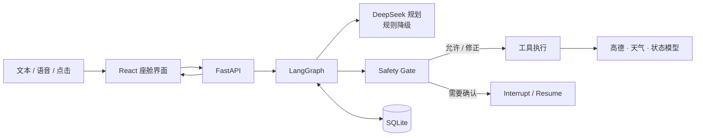

# CabinGuard V3 路演 PPT 大纲（10–15 分钟）

> 建议 10 页正文 + 1 页备用页。按每页约 1 分钟控制；现场网络不稳定时，优先使用预先录制的演示视频或截图。

## 第 1 页｜封面（0.5 分钟）

**标题：** CabinGuard V3——主动式智能座舱 Agent  
**副标题：** 让座舱从“响应指令”走向“理解状态、安全协作”

- 团队/成员、比赛名称、日期
- 一句话定位：一个结合多轮对话、主动服务与安全门控的智能座舱仿真原型

**讲述要点：** 今天展示的不是单纯的语音助手，而是一个能理解上下文、主动发现风险、并且不会绕过安全规则执行操作的座舱 Agent。

---

## 第 2 页｜问题与机会（1 分钟）

**标题：** 传统座舱助手的三个不足

- **被动**：通常要用户明确下令，难以结合疲劳、天气、温度等状态主动服务。
- **割裂**：导航、媒体、空调是彼此独立的功能，难以完成多步骤任务。
- **不可控**：大模型能理解自然语言，但不能直接获得车控权限，否则存在安全和可解释性风险。

**视觉建议：** 用“用户 → 单项功能”的传统流程，对比“状态 + Agent → 安全执行”的 CabinGuard 流程。

**讲述要点：** 智能座舱的关键不是回答更像人，而是能否在正确的时机做正确的事，并清楚地说明为什么。

---

## 第 3 页｜方案概览（1 分钟）

**标题：** CabinGuard：主动、连续、安全、可恢复

- 输入：文字、浏览器语音、地图点击与预设驾驶场景。
- 理解：DeepSeek 结构化规划 + 本地规则降级。
- 决策：读取车辆、驾驶员、座舱、导航和天气状态。
- 执行：所有工具操作先经过 Safety Gate。
- 体验：前端展示状态、候选项、确认卡片、工具日志和执行轨迹。

**视觉建议：** 放一张产品界面截图，并用 4 个标注指出地图、状态卡、Agent 面板、模拟器。

**讲述要点：** 即便模型或网络不可用，常用的确定性控制仍可降级执行；系统不会伪造天气或路线结果。

---

## 第 4 页｜核心架构（1.5 分钟）

**标题：** 以状态图组织多轮交互，而非一次性聊天

- React/Vite：座舱交互与可视化。
- FastAPI：会话、状态和 WebSocket 推送。
- LangGraph + SQLite：多轮状态、确认中断、刷新恢复。
- DeepSeek：受限 JSON 规划，不直接控制系统。

**讲述要点：** 架构的核心是把“理解”和“执行”拆开：模型可以建议工具调用，但执行权始终由状态图和安全规则掌握。

---

## 第 5 页｜典型闭环：导航（1.5 分钟）

**标题：** 从模糊目的地到可确认导航

1. 用户说：“带我去虹桥站”。
2. 系统调用高德搜索 POI，展示火车站、地铁站、北进站口等候选项。
3. 用户回答“第三个”或“北进站口”，系统本地消歧；不能确定时，模型只能在已有候选中选择。
4. 获取路线，展示距离和预计时间。
5. 用户说“开始吧”，系统启动导航模拟；结束导航后清理路线、速度与驾驶时长。

**视觉建议：** 使用 5 格流程图或演示截图序列。

**讲述要点：** 这解决了自然语言导航中最常见的问题——同名地点和模糊表达。我们不允许模型编造目的地。

---

## 第 6 页｜安全设计：模型不能越过规则（1.5 分钟）

**标题：** 四级 Safety Gate

| 决策 | 示例 | 系统行为 |
| --- | --- | --- |
| ALLOW | 高疲劳提示休息 | 立即执行 |
| MODIFY | 高速时“按摩开最大” | 自动降到低档 |
| CONFIRM | 温度设为 34℃、切换正在进行的导航 | 展示确认卡片，等待用户决定 |
| BLOCK | 行驶中播放电影 | 拒绝执行并说明原因 |

**视觉建议：** 用红黄绿分级卡片，配合工具日志截图。

**讲述要点：** 安全不是提示词中的一句“请注意安全”，而是模型之外、可审计、可单测的确定性策略层。

---

## 第 7 页｜主动式服务（1 分钟）

**标题：** 从“等指令”到“看状态、给建议”

- 点火后：查询当前位置天气并给出提示。
- 疲劳高或连续驾驶过久：主动提醒尽快休息。
- 注意力低：建议适度提高媒体音量。
- 座舱温度偏高：建议调节空调；舒适性操作仍需确认。
- 雨天场景：获取真实天气，满足条件时联动雨刷状态。

**讲述要点：** 主动不等于擅自操作。高优先级安全提醒可以直接发出，舒适性调整则保留给用户确认。

---

## 第 8 页｜现场演示（2–3 分钟）

**标题：** 演示：疲劳场景下的安全协作

**推荐演示脚本：**

1. 点击“正常通勤”，展示天气和座舱状态。（约 20 秒）
2. 输入“带我去虹桥站” → 选择“北进站口” → “开始吧”。（约 60 秒）
3. 点击“疲劳驾驶”。（约 15 秒）
4. 输入：“我太困了，放个电影，把按摩开到最大”。（约 30 秒）
5. 指出结果：疲劳提醒出现、视频被拦截、高速按摩自动降档；工具日志显示 BLOCK 与 MODIFY。（约 30 秒）

**演示备选：** 若高德或网络不可用，改为展示录屏，或切换到“疲劳驾驶”场景后演示安全门控与日志；提前说明地图服务需 API Key。

**讲述要点：** 这页尽量少讲，让界面和日志说明“Agent 理解了什么、做了什么、为什么这样做”。

---

## 第 9 页｜工程成果与验证（1 分钟）

**标题：** 可运行、可测试、可恢复

- 前后端分离：React/Vite + FastAPI，可独立开发，也可由后端托管构建产物。
- 持久化：SQLite 保存会话、待确认动作和显式偏好；刷新后恢复最近会话。
- 降级：DeepSeek 不可用时规则接管常用指令；天气失败时明确告知，不返回伪造数据。
- 自动化测试：覆盖候选消歧、导航清理、安全拦截、参数修正、雨天联动和主动策略。
- 当前测试结果：后端 20 项测试通过，前端生产构建通过。

**视觉建议：** 使用简洁的“20 passed / build passed”结果卡片，不要铺满终端截图。

---

## 第 10 页｜不足与下一步（1 分钟）

**标题：** 从演示原型走向可信车载系统

- **真实数据**：接入 CAN/车辆仿真器与驾驶员监控信号，替换当前场景模拟。
- **功能安全**：扩展策略表、操作权限、回滚机制；真实车控应经独立安全网关。
- **评测体系**：建设对话集和仿真场景集，衡量工具成功率、安全违规率、响应时间。
- **隐私与工程化**：偏好授权/删除、密钥管理、鉴权、限流、容器化与 CI/CD。
- **产品体验**：多用户 profile、充电/休息区推荐、更多车内交互方式。

**讲述要点：** 本项目清楚区分了软件仿真和真实车控。下一阶段首先补齐安全、隐私和可靠性，而不是盲目增加功能。

---

## 第 11 页｜总结与答谢（0.5 分钟）

**标题：** CabinGuard：让智能座舱“会理解，也守边界”

- 用状态图把多轮任务变得可恢复。
- 用大模型理解自然语言，用规则保证执行安全。
- 用主动服务把车辆、驾驶员和环境信息转化为及时协作。

**结束语：** CabinGuard 展示了一条可扩展的智能座舱 Agent 路径：模型负责理解，系统负责约束，用户始终拥有关键决策权。

---

## 备用页 A｜功能清单

- 导航：POI 搜索、候选项消歧、路线预览、开始/结束、路线模拟。
- 座舱：空调、媒体、座椅、车窗、雨刷状态。
- 主动：天气、疲劳、注意力、温度。
- 交互：文字、浏览器语音、语音播报、点击候选、确认卡片。
- 可观测：状态、服务可用性、工具日志、执行轨迹。

## 备用页 B｜可能问答

**Q：为什么要使用大模型，规则不够吗？**  
A：规则能覆盖高频明确命令，但复杂表达、上下文省略和候选地点语义消歧需要更强的语言理解；模型只负责受限规划，不获得执行权限。

**Q：模型胡乱调用工具怎么办？**  
A：工具名白名单、结构化输出、状态图路由和 Safety Gate 共同约束；关键操作还会要求用户确认。

**Q：能直接装到真实汽车上吗？**  
A：不能直接用于真实车控。当前是仿真 MVP；真实部署需接入车规级网关、功能安全机制、权限体系、测试与合规流程。

**Q：网络或 API 不可用时怎么办？**  
A：模型不可用时退回本地规则；天气与地图失败时明确提示；测试与关键演示场景可使用 mock 或录屏准备。
