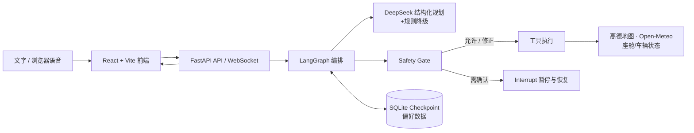

# CabinGuard V3

CabinGuard 是一个面向智能座舱场景的主动式 Agent MVP。它将自然语言/浏览器语音输入转换为受安全策略约束的导航、天气和座舱控制操作，并在疲劳、注意力下降或座舱温度异常时主动提醒。

项目对应“智能座舱与人车交互”方向：重点不只是执行指令，也让系统结合车辆、驾驶员和座舱状态做出可解释的服务与安全决策。

## 已实现能力

- **多轮智能交互**：DeepSeek 将中文输入规划为结构化工具调用；模型不可用时，规则引擎仍可处理常用导航、天气和座舱控制指令。
- **安全门控**：行驶或导航中禁止视频播放；高速时将高强度座椅按摩降为低档；超出 18–28℃ 的温度请求需要确认；更换正在执行的导航也需要确认。
- **导航闭环**：高德 POI 搜索 → 候选地点消歧 → 驾车路线预览 → 用户确认开始 → 模拟行驶 → 取消并清理状态。候选项可点击、说序号或说地点关键词。
- **主动服务**：点火后查询天气；高疲劳或长时间驾驶时提示休息；低注意力时建议调高媒体音量；温度过高时建议自动调节。
- **可控座舱**：空调、座椅加热/按摩、媒体、车窗、雨刷状态均可由 Agent 更新并显示在界面上。
- **会话与偏好记忆**：LangGraph + SQLite 保存会话、待确认操作和状态；刷新或后端重启后可恢复。仅保存用户明确要求记住的偏好。
- **可解释性**：前端显示服务可用性、待确认操作、工具与安全日志以及 Agent 执行轨迹。

## 技术架构



| 层级 | 主要技术 | 职责 |
| --- | --- | --- |
| 前端 | React 18、TypeScript、Vite、高德 JS 地图 | 座舱仪表、路线展示、语音交互、场景模拟与状态展示 |
| 服务端 | FastAPI、WebSocket、Pydantic | 会话 API、状态校验、前端静态资源托管 |
| Agent | LangGraph、DeepSeek API | 状态图编排、结构化意图规划、中断恢复、规则降级 |
| 安全与业务 | 自定义 Safety Gate、工具执行器 | 风险拦截、参数修正、导航/车控/天气业务逻辑 |
| 外部服务 | 高德 Web 服务、Open-Meteo | POI 搜索、驾车路线、实时天气与地理编码 |
| 持久化 | SQLite、LangGraph Checkpoint | 多轮会话、待确认操作、用户明确偏好 |

更完整的设计复盘、难点和改进计划见 [project-report.md](project-report.md)。

## 环境要求

- Python 3.11+（建议）
- Node.js 18+、npm
- 可选：DeepSeek API Key、高德 Web 服务 Key、高德 JS 地图 Key

未配置 DeepSeek 或高德时，系统仍可启动；对应能力会显示为“未配置”，而本地规则控制和界面演示仍可使用。天气功能使用 Open-Meteo；网络不可用时会明确提示，项目不会伪造天气结果。

## 配置

项目已提供可提交的配置模板。先复制模板，再按需填写 Key；真实 `.env` 不应提交到 Git：

```bash
cp .env.example .env
```

也可以手动创建 `.env`：

```dotenv
# 可选：语义规划。未配置时使用本地规则降级。
DEEPSEEK_API_KEY=your_deepseek_key
DEEPSEEK_BASE_URL=https://api.deepseek.com
DEEPSEEK_MODEL=deepseek-v4-flash
# WSL 代理可用时才设为 true；默认不使用系统代理。
DEEPSEEK_USE_ENV_PROXY=false

# 可选：POI 搜索和驾车路线。
AMAP_WEB_SERVICE_KEY=your_amap_web_service_key

# 可选：浏览器地图展示（前端变量需写入 frontend/.env.local）。
# VITE_AMAP_JS_KEY=your_amap_js_key
# VITE_AMAP_SECURITY_CODE=your_amap_security_code

# 天气缓存时间（秒），默认 600。
WEATHER_CACHE_SECONDS=600
```

如需在地图中展示真实高德底图，将最后两项放入 `frontend/.env.local` 后重新启动 Vite；未配置时前端会显示简化路线示意。

## 安装与启动

在项目根目录执行：

```bash
python3 -m venv .venv
.venv/bin/pip install -r backend/requirements.txt

cd frontend
npm ci
cd ..
```

`package-lock.json` 已纳入版本控制，`npm ci` 会按锁定版本安装前端依赖。Python 依赖目前使用 `backend/requirements.txt` 中的兼容版本范围；如需完全固定 Python 环境，建议在目标部署环境生成并提交经过评审的锁定文件。

开发模式需要两个终端：

```bash
# 终端 1：后端
PYTHONPATH=backend .venv/bin/uvicorn app.main:app --reload
```

```bash
# 终端 2：前端
cd frontend
npm run dev
```

访问 `http://localhost:5173`。后端健康检查为 `http://localhost:8000/api/health`，FastAPI 接口文档为 `http://localhost:8000/docs`。

### 演示构建

```bash
cd frontend
npm run build
cd ..
PYTHONPATH=backend .venv/bin/uvicorn app.main:app
```

此时访问 `http://localhost:8000`。后端会在 `frontend/dist` 存在时托管前端构建产物。

## 推荐演示流程

1. 点击“正常通勤”，观察点火后的天气与座舱建议。
2. 输入或说“带我去虹桥站”。
3. 点击候选地点，或回答“火车站”“第三个”“北进站口”。
4. 看到路线预览后回答“开始吧”，观察导航状态、速度和驾驶时长模拟。
5. 点击“疲劳驾驶”，再输入“我太困了，放个电影，把按摩开到最大”。系统会触发疲劳提醒、拦截视频，并将高速按摩强度降档。
6. 点击“重新开始演示”验证会话状态清理；浏览器 profile 下已明确保存的偏好会保留。

浏览器不支持原生语音识别时，可以直接键盘输入；语音播报可随时停止。

## 测试

```bash
PYTHONPATH=backend .venv/bin/pytest backend/tests -q
cd frontend && npm run build
```

现有后端测试覆盖候选地点消歧、导航状态清理、路线坐标插值、安全门控、雨天雨刷以及部分主动策略。外部服务在测试中以 mock 替代，不依赖真实 API Key。

## 目录说明

```text
backend/
  app/             FastAPI、LangGraph、工具、安全规则与服务适配器
  tests/           业务逻辑测试
  data/            运行时 SQLite 数据库（首次启动创建）
frontend/
  src/             React 座舱界面、地图与语音交互
docs/
  README.md        项目使用说明
  project-report.md 项目复盘与后续规划
  V3计划.md        V3 架构设计与实施规划
```
