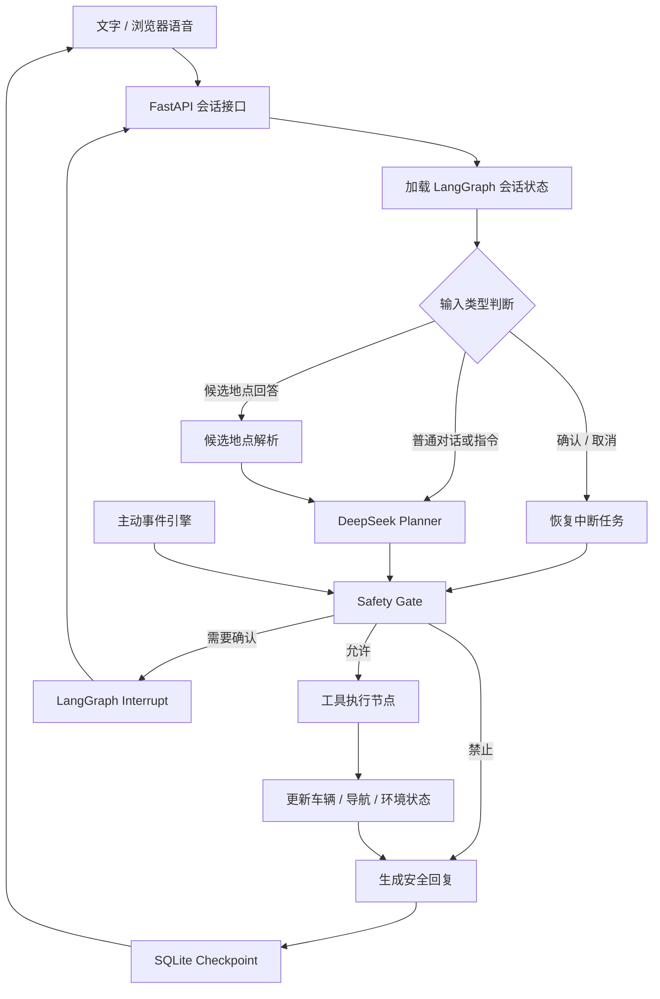

## 一、最终版目标架构

保留当前已经稳定的部分：

- React/Vite 座舱界面
- FastAPI 后端
- DeepSeek API
- 高德 POI 搜索、路径规划和地图展示
- 浏览器原生语音输入/播报
- 当前车辆状态、驾驶时长、速度模拟
- 安全门控和地点候选项自然语言选择

重构核心编排层：



LangGraph 负责的是“流程、状态、中断恢复和工具调度”，DeepSeek 仍然负责自然语言理解、意图规划和复杂候选项判断。不会把所有逻辑都交给大模型。

LangGraph 原生支持持久化执行、线程状态和人机确认中断，正适合当前项目里的多轮导航、安全确认以及刷新恢复问题。[LangGraph Overview](https://docs.langchain.com/oss/python/langgraph/overview) · [Persistence](https://docs.langchain.com/oss/python/langgraph/persistence) · [Interrupts](https://docs.langchain.com/oss/python/langgraph/interrupts)

## 二、Graph State 设计

建立统一的 `CabinGuardState`，替代目前分散在内存 SessionStore、导航流程和前端状态里的信息。

核心字段：

- `messages`：多轮对话消息
- `session_id`：对应 LangGraph `thread_id`
- `vehicle_state`：速度、点火状态、驾驶时长
- `cabin_state`：温度、空调、车窗、座椅
- `driver_state`：疲劳程度、注意力状态
- `navigation_state`：当前位置、目的地、路线状态
- `poi_candidates`：等待用户选择的地点列表
- `pending_action`：等待安全确认的操作
- `trigger_state`：主动提醒的冷却时间和去重信息
- `user_preferences`：明确保存的用户偏好
- `tool_history`：本轮工具调用与结果
- `provider_status`：DeepSeek、高德、天气服务状态
- `final_response`：最终回复

关键原则：

- 一次用户输入只执行一次 Graph。
- 前端刷新后通过 `thread_id` 恢复，而不是重新创建一套半空状态。
- 后端重启后，多轮上下文和待确认操作仍然可以恢复。
- 前端不再自己推断“Agent 是否完成”，只根据后端状态判断。

## 三、LangGraph 节点划分

### 1. 输入路由节点

优先处理确定性流程：

- 是否在回答地点候选项
- 是否在确认或取消高风险操作
- 是否是导航中止、停车等明确命令
- 是否是普通对话或新的任务

例如：

- “第二个”
- “虹桥站北边那个”
- “不是地铁站”
- “就去北进站口”

会先由本地规则匹配；不能可靠判断时，再让 DeepSeek 在限定候选项中选择，禁止它生成候选列表之外的地点。

### 2. DeepSeek Planner 节点

DeepSeek 输出结构化决策，而不是直接控制系统：

```
{
  "intent": "start_navigation",
  "reply": "好的，我准备为您导航。",
  "tool_calls": [
    {
      "name": "start_navigation",
      "arguments": {
        "poi_id": "..."
      }
    }
  ]
}
```

继续沿用当前稳定的 DeepSeek HTTP 客户端，LangGraph 只包裹和编排它。这样可以避免为了迁移架构，同时更换模型调用链路而引入额外风险。

### 3. Safety Gate 节点

所有工具在执行前统一检查：

- `ALLOW`：直接执行
- `CONFIRM`：通过 LangGraph `interrupt()` 暂停
- `DENY`：拒绝执行并解释原因

确认后使用 `Command(resume=...)` 从原节点恢复，避免目前“确认消息被当成新对话”一类问题。

不会直接使用一个无门控的通用 ToolNode。工具执行节点必须经过 CabinGuard 自己的 Safety Gate。

### 4. 工具执行节点

现有能力统一包装成 LangChain 工具：

- `search_poi`
- `plan_route`
- `start_navigation`
- `stop_navigation`
- `set_temperature`
- `set_window`
- `set_seat`
- `get_weather`
- `get_vehicle_status`
- `save_user_preference`

工具通过结构化结果更新 Graph State。LangChain 工具支持通过运行时上下文和 `Command` 更新状态。[LangChain Tools](https://docs.langchain.com/oss/python/langchain/tools)

### 5. 回复生成节点

区分三类回复：

- 确定性系统回复：导航开始、停车、确认提示
- DeepSeek 自然语言回复：闲聊、解释、复杂表达
- 降级回复：DeepSeek 超时或不可用时，仍能完成确定性操作

因此不是“DeepSeek 不通就完全不能开车”，而是智能理解降级，基础控制仍可工作。

## 四、持久化和记忆

### 会话持久化

使用 `AsyncSqliteSaver`：

- 数据库位置建议：`backend/data/cabinguard.db`
- `session_id` 映射为 LangGraph `thread_id`
- 页面刷新恢复最近会话
- 后端重启恢复多轮消息、候选地点和安全确认状态

### 用户偏好记忆

长期记忆只保存用户明确要求记住的内容，例如：

- “以后空调默认调到 24 度”
- “记住我常去上海虹桥站”
- “导航提示音小一点”

不自动把所有聊天记录永久保存，也暂时不加入向量数据库。路演版使用 SQLite 表足够稳定、透明。

## 五、主动式 Agent 功能

增加独立的主动事件引擎，但所有事件仍进入同一张 Graph。

首批主动能力：

1. 点火后播报天气和车辆状态。
2. 连续驾驶达到阈值时提醒休息。
3. 驾驶员疲劳等级升高时分级提醒。
4. 座舱温度异常时建议或执行空调调整。
5. 开始导航后提示目的地天气。
6. 导航过程中模拟车速和驾驶时长，但地图车辆不移动。
7. 停止导航后速度归零、驾驶时长清零并清除路线。

增加防骚扰策略：

- 同类事件冷却时间
- 相同内容去重
- 事件优先级
- 高风险事件允许越过冷却期
- 主动提示和用户指令冲突时，以用户指令及安全策略优先

## 六、天气与外部服务

天气功能做成独立服务适配层：

- 真实天气数据
- 请求超时
- 短期缓存
- 明确展示数据来源
- 不再使用看起来像真实结果的演示数据
- 服务不可用时返回“当前无法获取”，不捏造天气

MCP 可以作为最终版扩展接口，但不建议让路演运行强依赖额外 MCP 进程。先把天气服务做成可替换适配器，之后可以平滑接入 FastMCP。

## 七、前端路演增强

前端不大改视觉风格，重点增加可解释性和稳定性：

- 当前状态：空闲、理解中、调用地图、等待确认、完成、降级
- 服务状态：DeepSeek、高德、浏览器语音、天气
- “重新开始演示”按钮：清理会话、导航和车辆状态
- 待确认操作使用明显卡片展示
- 地点候选项可以点击，也支持自然语言和语音选择
- DeepSeek 超时、高德失败、语音不可用分别提示，避免统一显示“Agent 超时”
- 页面刷新时显示“正在恢复会话”，恢复失败后自动创建新会话
- 增加可折叠的 Agent 执行轨迹：理解意图 → 安全检查 → 搜索地点 → 路径规划

## 八、可观测性

采用两层方案：

- 默认：本地结构化日志，保证无外部依赖也能调试。
- 配置 LangSmith Key 后：启用 LangGraph Trace 和测试数据集。

记录：

- 每次 Graph 运行耗时
- 当前进入了哪些节点
- DeepSeek 请求耗时和失败原因
- 高德和天气调用结果
- Safety Gate 决策
- Interrupt 暂停与恢复
- 最终回复来源：DeepSeek、规则或降级

LangSmith 可以针对 Agent 轨迹和数据集进行离线、在线评估。[LangSmith Evaluation](https://docs.langchain.com/langsmith/evaluation)

## 九、实施阶段

### 阶段 1：建立 LangGraph 骨架

- 添加 LangGraph、LangChain Core、SQLite Checkpoint 依赖
- 定义 `CabinGuardState`
- 建立 Graph 和条件边
- 保持现有 HTTP API 和前端调用方式不变
- 普通问候和多轮对话迁移到 Graph

验收：连续发送“你好”“早上好”“你记得我刚才说什么吗”均正常。

### 阶段 2：迁移导航和候选项流程

- POI 搜索、候选项解析、路线规划工具化
- 支持点击、序号、汉字数字和自然语言选择
- 无法确定时由 DeepSeek 限定选择
- 开始、取消、结束导航全部进入 Graph

验收：完整完成“带我去虹桥站 → 去北进站口 → 开始导航 → 结束导航”。

### 阶段 3：迁移 Safety Gate

- 工具执行前集中门控
- 高风险动作使用 `interrupt`
- 确认、取消和超时恢复
- 刷新页面后仍能看到待确认操作

验收：确认不会丢失，也不会把“确认”误判成新的聊天内容。

### 阶段 4：持久化和用户记忆

- 接入 AsyncSQLite Checkpointer
- 替换内存 SessionStore 的核心职责
- 增加明确的偏好保存和删除
- 后端重启恢复会话

验收：重启 Uvicorn 后继续上一轮导航对话。

### 阶段 5：主动事件引擎

- 疲劳、温度、点火、目的地天气事件
- 冷却、去重和优先级
- 所有主动事件经过 Graph 和 Safety Gate

验收：事件会主动触发，但不会连续重复播报。

### 阶段 6：路演稳定化

- 前端服务状态和 Agent 轨迹
- 日志与可选 LangSmith Trace
- 一键重置演示
- 浏览器语音回归测试
- 超时、断网和外部 API 失败降级

## 十、最终测试矩阵

至少覆盖：

- Graph 节点和条件边单元测试
- 多轮会话测试
- 候选地点各种表达方式
- Safety Gate 允许、确认、拒绝
- Interrupt 暂停和恢复
- SQLite 重启恢复
- DeepSeek 超时降级
- 高德无结果、多个结果、路线失败
- 主动提醒去重和冷却
- 页面刷新恢复
- 浏览器语音输入后的完整链路
- Playwright 路演流程端到端测试

最终验收标准：

- 连续多轮对话不再卡死。
- 刷新页面不会长期停在“CabinGuard 正在启动”。
- 后端重启可以恢复会话。
- 导航、空调、车窗等操作全部经过同一编排链路。
- 高风险操作一定确认，低风险操作不被过度打断。
- DeepSeek 或外部服务偶发超时时，界面可恢复且基础功能可用。
- Azure Speech、本地语音模型完全不参与路演运行。

这版的核心定位会很清晰：**LangGraph 是座舱 Agent 的状态与执行中枢，DeepSeek 是认知规划层，高德和车辆控制是工具层，Safety Gate 是所有动作不可绕过的安全边界。**