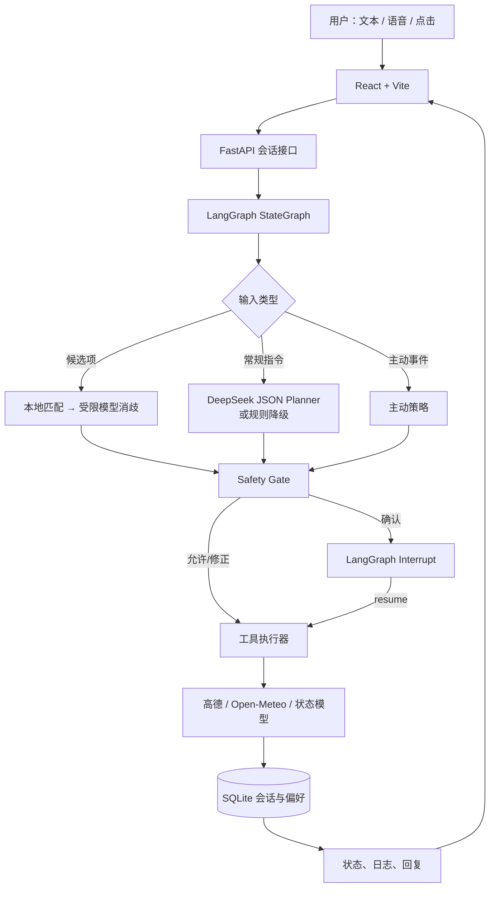

# CabinGuard V3 项目报告

## 1. 项目概述

### 1.1 背景与目标

CabinGuard V3 是一个主动式智能座舱 Agent 原型，面向“让车理解人并主动服务人”的人车交互场景。传统座舱助手大多是单轮、被动地执行指令；本项目尝试把用户语言、车辆状态、驾驶员状态、座舱状态和外部环境放入同一个决策流程中，使系统能够完成连续任务、在风险场景下约束操作，并在必要时主动提醒。

项目的核心目标为：

1. 支持中文文字与浏览器语音交互，理解导航、天气和座舱控制意图。
2. 将导航做成可恢复的多步骤流程，而不是一次性文本回答。
3. 在模型输出和车辆控制之间加入确定性的安全门控。
4. 支持疲劳、注意力、温度等状态驱动的主动服务。
5. 将过程、状态和风险决策展示给用户，保证演示可解释、可降级、可恢复。

### 1.2 项目边界

该项目是软件仿真 MVP，不直接连接真实车辆 CAN、执行器或驾驶员监控硬件。车速、位置、驾驶时长和驾驶员状态由前端场景或接口模拟；高德路线和 Open-Meteo 天气是实际在线服务。所有“控制”仅更新项目内的状态模型，不能替代真实车辆功能安全系统。

## 2. 主要完成内容

### 2.1 统一的座舱状态模型

后端使用 Pydantic 定义会话状态，集中表示：

- 车辆：点火、速度、经纬度、雨刷；
- 驾驶员：疲劳、注意力、压力、情绪、连续驾驶时间；
- 座舱：温度、空调、媒体、音量、座椅加热/按摩/通风、车窗；
- 导航：候选 POI、目的地、路线、路线状态、模拟速度与行驶时长；
- Agent：对话历史、待确认操作、工具日志、主动告警、执行轨迹、服务状态。

这种建模让 Agent 决策不再只依赖当前一句话。例如“放个电影”会同时读取车速和导航状态；“开始吧”会读取是否已经获得路线预览。

### 2.2 LangGraph 多轮编排与恢复

项目使用 LangGraph 实现 `输入路由 → 候选项消歧/语义规划 → Safety Gate → 工具执行 → 回复构建` 的状态图。SQLite Checkpointer 按 `session_id` 保存图状态，因而页面刷新或后端重启后仍能恢复对话、导航进度及“等待确认”的中断状态。

当系统遇到需用户确认的操作时，通过 LangGraph `interrupt()` 暂停图执行；用户确认或取消后，后端用 `Command(resume=...)` 从原位置继续，而不是将“确认”误当作新对话。这是实现可靠多轮交互的关键。

### 2.3 大模型规划与规则降级

DeepSeek 仅负责语义理解和输出受限 JSON，包括意图、自然语言回复和白名单内工具调用。它不直接操作车辆状态。规划结果会经过工具名称与参数结构校验，再进入安全层。

若未配置 DeepSeek 或请求超时/异常，规则规划器会接管常见指令：导航、天气、空调、座椅、视频和音乐。因此网络或模型异常不会让基础演示完全失效，代价是复杂表达的理解能力会下降。

### 2.4 导航和外部信息服务

导航闭环使用高德 Web 服务：

1. 从自然语言中抽取目的地并搜索 POI；
2. 将候选项展示给用户；
3. 支持点击候选项、中文/阿拉伯数字序号、别名与关键词匹配；
4. 本地无法可靠消歧时，让模型只能在已有候选集合中选择；
5. 获取驾车路线后展示距离、预计时间和路线；
6. 用户确认后开始导航模拟，可随时结束并清理路线状态。

天气通过 Open-Meteo 获取真实当前天气、体感温度、降水概率和风速，并按坐标进行短期缓存。服务不可用时返回明确失败信息，不生成看似真实的虚构天气。

### 2.5 Safety Gate

安全层是项目中模型之外的确定性约束，所有工具执行前均会给出 `ALLOW`、`MODIFY`、`CONFIRM` 或 `BLOCK` 之一，并写入工具日志。

| 场景 | 策略 | 结果 |
| --- | --- | --- |
| 行驶中或导航中播放电影/视频 | BLOCK | 拒绝播放 |
| 速度超过 80 km/h 时高强度按摩 | MODIFY | 自动降为低档 |
| 请求温度低于 18℃ 或高于 28℃ | CONFIRM | 建议调整到 23℃，等待用户确认 |
| 未预览路线就开始导航 | CONFIRM / BLOCK | 提示先规划或要求明确目的地 |
| 正在导航时重新搜索或切换目的地 | CONFIRM | 用户确认后才切换 |
| 高疲劳高速行驶 | ALLOW | 立即发出安全提醒 |

### 2.6 主动式服务与前端呈现

系统在状态更新或场景切换后运行主动检查：点火后查询天气；疲劳等级较高或连续驾驶过久时提醒休息；注意力低时建议适度提高媒体音量；座舱温度高时提出空调调节建议。主动舒适性调节同样经过安全确认，避免系统擅自改变环境。

React 前端提供车辆/驾驶员模拟器、地图与路线区域、座舱状态卡片、对话面板、候选地点按钮、确认卡片、安全工具日志和执行轨迹。浏览器原生语音识别和语音合成增强了交互感；不支持时可退回文本输入。WebSocket 用于把服务端状态变化推送给当前会话页面。

## 3. 系统架构与搭建过程

### 3.1 架构



### 3.2 搭建步骤

1. **前端基础界面**：使用 React、TypeScript 和 Vite 构建三栏座舱界面，先以本地状态展示车辆、座舱和对话。
2. **后端 API 与数据模型**：以 FastAPI 提供创建会话、消息、恢复确认、重置、场景模拟和导航推进接口；使用 Pydantic 限制状态边界。
3. **外部服务适配**：将高德 POI/路径和 Open-Meteo 天气封装在独立服务层，设置短超时并向上返回用户可读错误。
4. **工具执行器**：把业务动作抽象为导航、天气、媒体、座椅、空调和安全提醒等工具，工具统一更新状态与日志。
5. **安全层**：在工具前独立实现规则判断，允许、修正、确认和阻止四种结果，而非依赖模型自行“注意安全”。
6. **Agent 图迁移**：用 LangGraph 管理路由、规划、确认中断与执行；使用 SQLite Checkpointer 管理线程级会话恢复。
7. **演示与测试**：加入预设通勤、雨天、注意力分散、疲劳驾驶场景；对导航消歧、安全规则、路线状态和主动策略编写异步单元测试。

### 3.3 运行方式

详细命令与环境变量见 [README.md](README.md)。本地开发中分别启动 Uvicorn 和 Vite；演示构建后由 FastAPI 直接托管 `frontend/dist`。运行后生成的 SQLite 文件位于 `backend/data/cabinguard.db`，其中含 LangGraph 检查点和偏好数据，属于本地运行数据而非源码。

## 4. 过程中的主要困难与解决方式

### 4.1 自然语言的模糊性与导航消歧

“带我去虹桥站”可能对应火车站、地铁站、机场或不同进站口；若直接把模型输出作为目的地，会出现不可控或错误导航。项目先依赖高德返回的候选 POI，并优先用本地规则识别点击 ID、序号、中文数字、别名和关键词。只有本地无法判断时，才让模型从候选集合中选择，且低置信度时继续追问。这使模型不能虚构新的目的地。

### 4.2 多轮确认容易被当成普通消息

确认操作涉及“暂停—展示—恢复”的生命周期。如果只把“确认”再次发送给普通聊天接口，原始工具参数和上下文容易丢失，尤其在页面刷新或后端重启之后。项目以 LangGraph interrupt 保存暂停点和待确认动作，再用 resume 恢复同一图运行；SQLite Checkpoint 解决了暂停状态无法持久化的问题。

### 4.3 大模型灵活性与安全确定性的冲突

大模型适合理解“我太困了”“太烫了”这样的自然表达，却不应直接决定高风险操作。项目将模型定位为受限规划器：只能输出白名单工具，所有执行必须经过 Safety Gate。规则层可改写参数、请求确认或拒绝操作，同时把原因显示在日志中。这使安全策略可审计、可测试、可独立迭代。

### 4.4 外部依赖不稳定

地图、天气和模型调用都会受网络、密钥、配额与代理配置影响。解决方案包括：

- 为 HTTP 请求设置连接和总超时；
- 以独立异常转换为用户可读消息；
- 天气使用短期缓存降低重复请求；
- DeepSeek 不可用时采用本地规则降级；
- 未配置地图 JS Key 时以简化路线视图保持前端可演示；
- 测试使用 mock 替代在线服务，避免依赖真实密钥。

### 4.5 前后端状态一致性

导航、主动提示和确认操作都可能异步更新状态，若前端自行推测 Agent 是否完成，容易造成显示不一致。项目让后端成为状态唯一来源：前端持有会话 ID、加载最近状态，并通过 API 响应和 WebSocket 更新界面；每个会话在后端使用异步锁串行执行图，避免同一会话并发写入。

### 4.6 演示真实性与可控性的平衡

完全接入真实车辆和真实行驶位置超出 MVP 范围，但纯静态页面又无法呈现主动 Agent 的价值。项目以可调滑条、预设场景和每秒推进的导航模拟来制造可重复的状态变化，同时在报告中明确该能力仅为仿真，不将其包装成真实车控。

## 5. 验证与当前成果

项目已包含后端自动化测试，覆盖：

- POI 候选项的关键词、中文序号与受限模型消歧；
- 路线预览、开始与结束后状态清理；
- 路线坐标插值逻辑；
- 行驶中视频拦截、高速按摩降档、越界温度确认；
- 雨天雨刷联动；
- 低注意力的主动媒体建议。

前端构建命令会运行 TypeScript 类型检查后生成生产文件。建议每次改动后执行：

```bash
PYTHONPATH=backend .venv/bin/pytest backend/tests -q
cd frontend && npm run build
```

验证时需注意：在线地图、天气和模型的端到端结果受密钥与网络影响，单元测试不以它们为前提；端到端演示应在配置密钥后的目标浏览器中完成。

## 6. 可提升方向

### 6.1 功能与产品

- 接入真实车辆信号或标准仿真器（CAN、车速、档位、DMS），并明确数据采样频率和可信度。
- 引入路线中的充电、停车、休息区推荐，以及基于时间/历史的目的地预测。
- 将偏好扩展为具备授权、查看、编辑、删除入口的长期记忆；当前仅支持明确写入的键值偏好。
- 支持更多模态，例如视觉/手势、方向盘按键、车内屏幕卡片和连续唤醒词。
- 增加多用户 profile、家庭成员区分和隐私模式。

### 6.2 Agent 与安全

- 为模型 JSON 输出增加 JSON Schema/Pydantic 的严格参数验证与重试策略，并限制单轮工具数量和副作用顺序。
- 把 Safety Gate 从当前规则集扩展为可配置策略表，覆盖档位、道路类型、驾驶员状态、法规区域和操作优先级。
- 对每个工具定义权限、风险等级、幂等性、回滚与审计记录；对真实车控采用独立安全 MCU/网关，Agent 只发出高层建议。
- 增加 prompt injection、异常输入、服务超时、并发确认和模型错误调用的红队测试。
- 建立离线对话集与仿真场景集，按意图识别、工具成功率、安全违规率、确认率和平均响应时间持续评估。

### 6.3 工程与可靠性

- 使用迁移工具管理 SQLite schema，并制定数据保留、导出与清除策略。
- 将服务状态、超时、重试、熔断与指标接入结构化日志和监控平台；当前已有界面状态和执行轨迹，但没有完整生产观测栈。
- 将 API 和前端部署到容器化环境，增加 CI：后端测试、前端构建、静态检查和依赖安全扫描。
- 为高德、天气和模型服务建立正式的适配器接口与契约测试，方便切换供应商。
- 增加 API 鉴权、速率限制、CORS 生产配置、密钥托管和传输/存储加密。当前 MVP 默认面向本地开发，不能直接作为公网车载服务部署。

### 6.4 交互与可用性

- 将内部状态码替换为用户可读的进度文案，并提供失败后的下一步建议。
- 为确认卡片加入风险等级、即将改变的状态和倒计时/撤销机制。
- 优化语音识别的权限引导、方言/噪声处理、打断播报和车载弱网场景。
- 完善无地图 Key、无语音能力、外部服务失败时的视觉降级，保证信息层级一致。

## 7. 结论

CabinGuard V3 已完成一个从“语音/文本理解”到“安全约束下工具执行”的闭环原型。项目的关键价值不在于让模型直接控制车辆，而在于将模型的灵活理解能力与状态图、持久化、多轮确认和确定性安全规则组合起来：模型可替换，规则可审计，过程可恢复，异常可降级。

后续若接入真实车辆或更大范围用户，应优先投入在功能安全、隐私授权、测试评估和服务可靠性上，再扩展交互和个性化能力。
